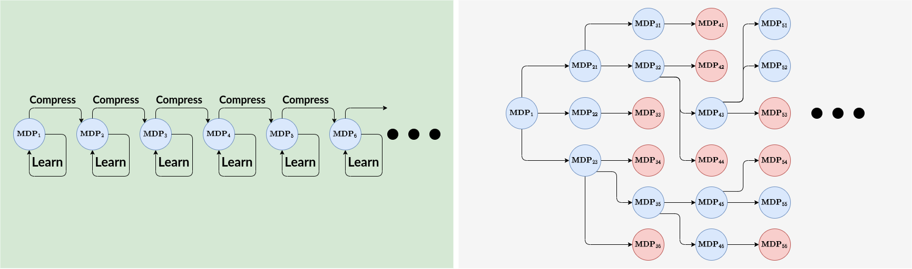
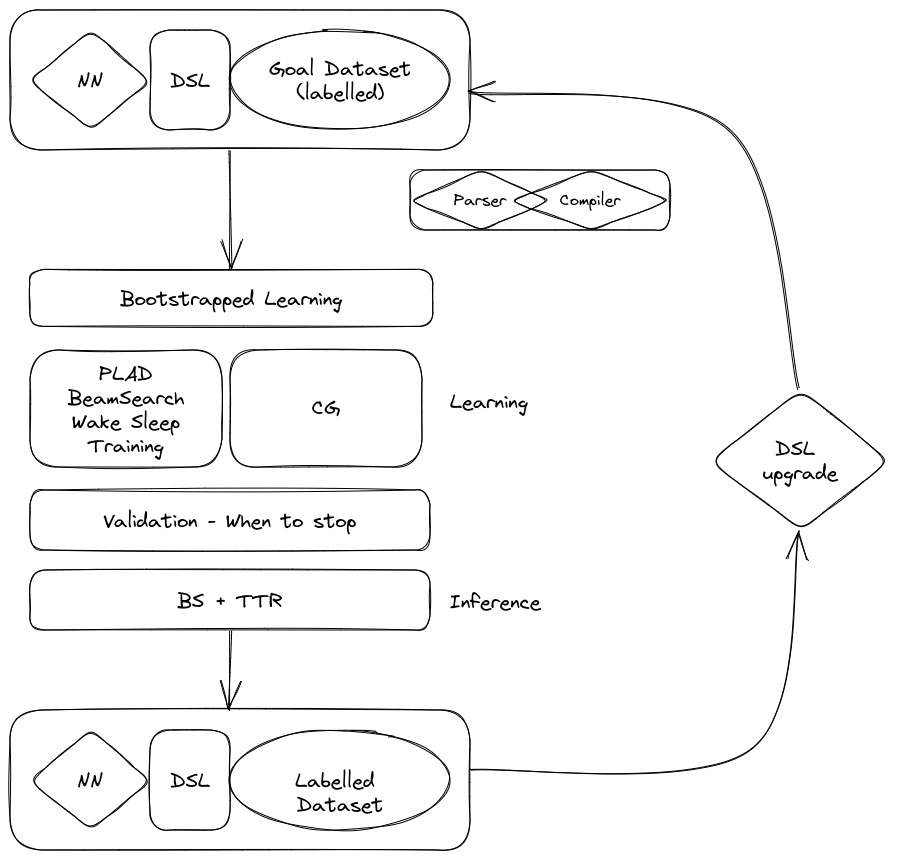

# Branching BAD (Bootstrapped Abstraction Discovery)

Spring 2023,[CSCI 2951X](https://cs.brown.edu/courses/cs2951x/) Course Project.

Course project team: Aditya Ganeshan.

Library learning where the right programs also have to be discovered from scratch. Similar to macro-action discovery in RL. The report of this project is [here](./assets/CSCI_2951X_Library_Learning.pdf).

**Note:** The results of this repository are "meh" in terms of the abstraction they discovered (not very meaningful). For systems which *really work* check out Kenny's work: [ShapeCoder](https://github.com/rkjones4/ShapeCoder.git) and the accompanied publication [here](https://arxiv.org/abs/2305.05661).

## Goals

1) Formulate library learning as Macro Action Discovery.
2) Make a simple version work (CSG2D language + Macro Action discovery using Code Grafting (From our [ICCV 2023 paper](https://arxiv.org/abs/2309.14972)).
3) Minor delta: Branching BAD (BAD with branching).

The branching many-world bootstrapped Abstraction Discovery 'attempted' in this project. The primary idea being that we don't need to be locked into the abstractions we discover.

## System

The code resembles this system.

**Environment:** Simple 2D CSG programs.

## Todos at some point

1) I think Abstraction Discovery using CG is a good idea. I think its still missing some ingredients which can make it work more effectively.
2) A big drop of performance in this work is because of the noticiably weaker Neural Model I adapted -> No conditional signals between the parameters predicted for each command. This is not a good idea (Lesson learnt!). But improvements can be expected by just changing the neural model.
3) Adapt the code to use GeoLIPI. A lot of the language level code can be used from the GeoLIPI code base. That can infact make this code base cleaner (and perhaps adapt to other langauges as well).
4) The idea of Branching the LL step is really essentially a question of: a) heavily searched right abstraction choices vs b) quick and dirty noisy abstractions with the possibility of backtracking. Quick and Dirty with backtracking seems more deployable.

## Instructions

To use the code follow the instructions in `instructions.md`, but lets be real here - the code is not very well documented. So feel free to reach out to me before you use this code!

## Acknowledgements

A big thanks to [George Konidaris](https://cs.brown.edu/people/gdk/) for conducting such a cool course. I really appreciate that he pushed us to go beyond some low hanging fruit -despite it simply being a course project (despite that, I think I still went for the low hanging fruit :P). I also thank [Kenny](https://rkjones4.github.io/) for the various discussions when I was doing this project! Finally, thanks to my advisor [Daniel](https://dritchie.github.io/) or being patient with me as I invested more time than necessary in course projects.
